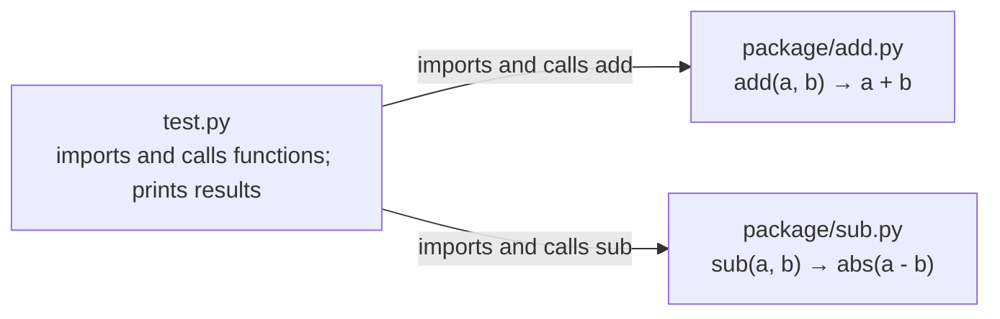

# Architecture

```mermaid
flowchart LR
    T["test.py<br/>imports and calls functions; prints results"]
    A["package/add.py<br/>add(a, b) → a + b"]
    S["package/sub.py<br/>sub(a, b) → abs(a - b)"]

    T -->|"imports and calls add"| A
    T -->|"imports and calls sub"| S
```
