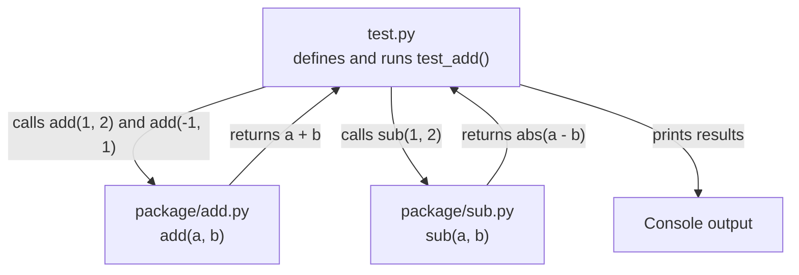

# Architecture

```mermaid
flowchart TD
    Script["test.py<br/>defines and runs test_add()"]
    Add["package/add.py<br/>add(a, b)"]
    Sub["package/sub.py<br/>sub(a, b)"]
    Console["Console output"]

    Script -->|"calls add(1, 2) and add(-1, 1)"| Add
    Script -->|"calls sub(1, 2)"| Sub
    Add -->|"returns a + b"| Script
    Sub -->|"returns abs(a - b)"| Script
    Script -->|"prints results"| Console
```
