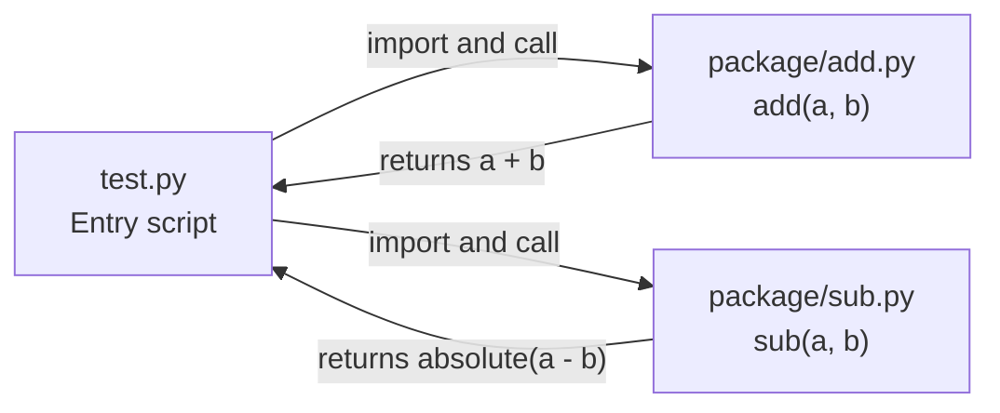

# Architecture

```mermaid
flowchart LR
    T["test.py<br/>Entry script"]
    A["package/add.py<br/>add(a, b)"]
    S["package/sub.py<br/>sub(a, b)"]

    T -->|"import and call"| A
    T -->|"import and call"| S
    A -->|"returns a + b"| T
    S -->|"returns absolute(a - b)"| T
```
